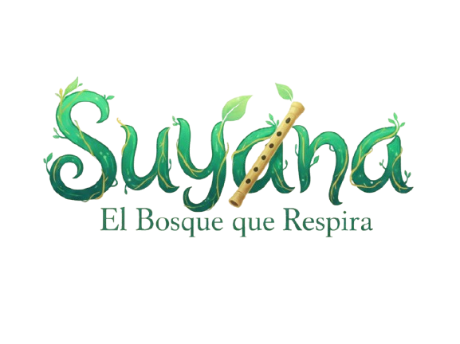

   

<h2>"Mientras exista esperanza, la tierra siempre volverá a respirar."</h2>
<h3> ✨ 1. Premisa: La Canción del Renacer</h3>

<strong>Suyana: El Bosque que Respira</strong> es un juego de plataformas 2D de aventura y <strong>puzzles</strong> con un enfoque restaurativo, inspirado en la belleza natural de los cerros y quebradas de Salta, Argentina.

El bosque, silenciado por la deforestación y el olvido, espera su renacer. Asumes el rol de <strong>Suyana (Esperanza, en quechua)</strong>, el espíritu etéreo que emerge de la última semilla. Armada con una flauta mágica, tu misión no es la batalla, sino la <strong>Restauración Armónica</strong>: soplar melodías para traer de vuelta el color, el sonido y la vida al ecosistema.

<h4>🎯 Objetivo Educativo</h4>

El proyecto busca promover la <strong>conciencia ambiental, la paciencia, la escucha activa</strong> y el valor de la <strong>armonía sobre la destrucción</strong> en niños (6-10 años) y familias.

---

<h3> 🎮 2. Pilares de Jugabilidad (Core Gameplay)</h3>

El juego reemplaza el combate tradicional con mecánicas centradas en la interacción rítmica y la resolución de acertijos ambientales:

| Mecánica | Descripción | Lección Implícita |
| :--- | :--- | :--- |
| **La Flauta y el Ritmo** | El jugador usa pulsaciones y secuencias rítmicas. Las notas agudas controlan el **Viento**, las notas graves manipulan la **Raíz** (tierra). | Mejora la **Memoria Auditiva** y la coordinación. |
| **Purificación y Color** | Usar el Soplo Básico para limpiar ceniza o niebla tóxica, revelando los colores vibrantes del arte 2D. | Muestra el impacto positivo de las acciones de **Limpieza Ambiental**. |
| **Puzzles Ambientales** | Los obstáculos se superan dirigiendo el viento o haciendo crecer raíces, exigiendo escuchar el ecosistema. | Fomenta la **Paciencia** y la **Lógica** en la aplicación de la herramienta correcta. |

---

<h3> 🎨 3. Tono y Estética </h3>
<ul>
<li> <strong>Género:</strong> Plataformas 2D de Aventura y Puzzles.</li> 
<li><strong>Motor:</strong> Godot 4.5.1</li> 
<li> <strong>Tono:</strong> Poético, mágico y restaurativo.</li> 
<li> <strong>Estética Visual:</strong> Ilustración digital 2D vibrante, con una clara influencia de <strong>Studio Ghibli</strong>strong> y una ambientación fiel a los paisajes del <strong>Noroeste Argentino (NOA)</strong>.</li> 
</ul>

---

<h3> 🤝 4. Colabora con Suyana</h3>

Este proyecto es de código abierto y busca colaboradores apasionados por la narrativa, el arte y la educación ambiental.

<h4> 🗺️ Estructura del Repositorio</h4>

| Carpeta | Propósito |
| :--- | :--- |
| **`/docs`** | Contiene el Guion, la Historia completa (`Historia_La_Cancion_del_Renacer.md`) y la Ficha de Personajes. **(¡Revisa aquí primero!)** |
| **`/game-design`** | Documentos detallando las mecánicas principales, diseño de niveles y conceptos de audio. |
| **`/assets`** | Arte conceptual, *mockups* visuales, y *wireframes* de UI. |
| **`/code`** | Archivos del motor Godot (4.x) y prototipos funcionales. |

---

<h3> 📖 5. Ficha Rápida: Antagonistas</h3>

Nuestros 'antagonistas' son representaciones del desequilibrio, no enemigos a destruir:

| Antagonista | Representación | Solución (No Violenta) |
| :--- | :--- | :--- |
| **La Máquina Gris** | Contaminación, Olvido Mecánico. | Transformación: Las raíces lo envuelven y lo convierten en tierra fértil. |
| **Fuego Errante** | Energía sin Control. | Canalización: La melodía lo transforma en calor vital para la germinación. |
| **El Silencio** | Apatía, Desesperanza. | Armonía: El jugador recuerda todas las melodías, restaurando el color y el sonido. |
